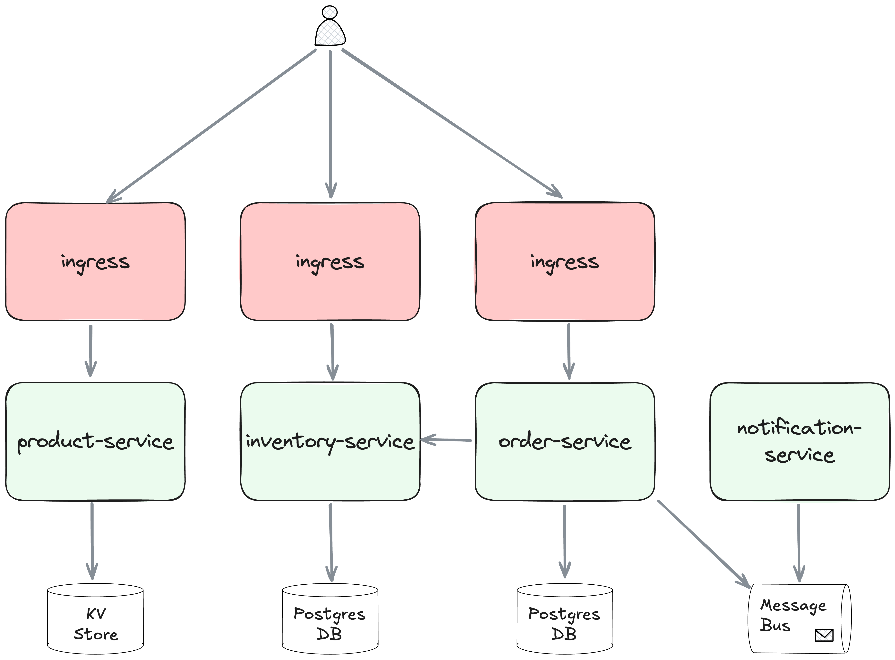

# Platform POC

Comparison of different deployment architectures for a small microservices
application.

1. Java Spring Boot, Containers, Kubernetes
   [example](./java-containers-k8s/README.md)
1. Rust, Containers, Kubernetes [example](./rust-containers-k8s/README.md)
1. Rust, WebAssembly (Wasm) Components
   - in wasmCloud on VMs [example](./platform-wasmcloud/README.md)
   - in wasmCloud on Kubernetes, with the wasmCloud Operator
     [example](./platform-wasmcloud/README.md)
   - in Spin on VMs — to be added
   - in Spin on Kubernetes, with SpinKube — to be added

> [!CAUTION] This PoC is intended to represent a small "enterprise-like"
> microservices application for demonstration only — it has some small "business
> logic" services, a KV Store, a SQL DB and a message broker. It is not intended
> to be a good example of such an application, and there has been no attention
> paid to best practices, security, or performance.

This diagram shows the application services as Wasm components running in
wasmCloud:

