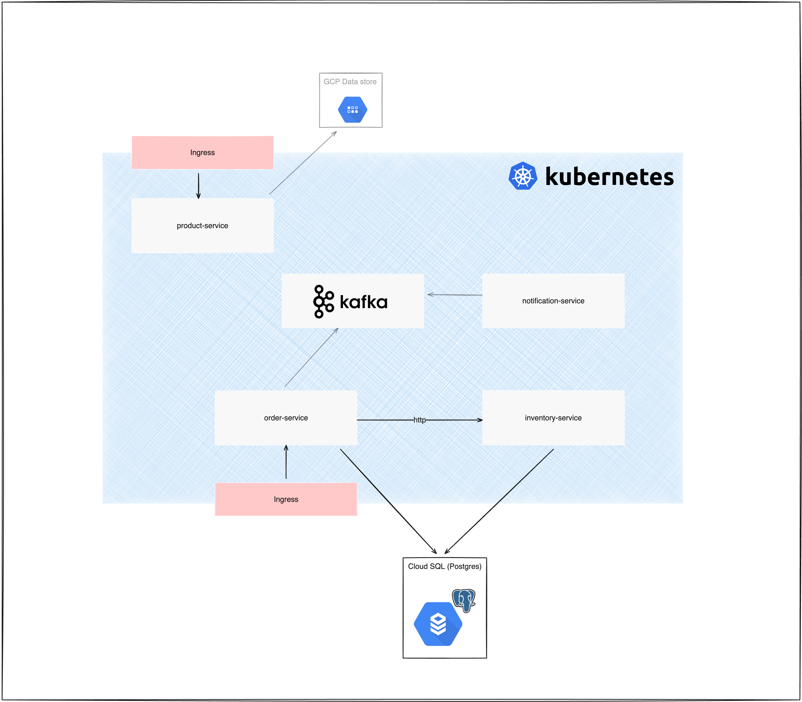

[](https://github.com/redbadger/spring-boot-microservices/actions/workflows/build.yml)

# spring-boot-microservices POC

This is a sample project to set up a set of microservices in GKE. It is to be used as a benchmark to compare against
next-gen platform deployment options with rust.

## High level architecture

This project is heavily inspired by [work in this repo](https://github.com/SaiUpadhyayula/spring-boot-microservices).

There are 4 services described in the diagram below



1. **Product-service** - uses the GCP NoSQL Data store to persist the product catalog. The products can be queried as a list and new products can be created through the api endpoint.
2. **Order-service** - takes a request of a list of order line items, checks they are all in stock (http call to the inventory service) and if so, creates an order entry in the database. Afterwards it sends an event to notificationTopic kafka topic.
3. **Inventory-service** - takes a request for a product and checks whether it's in stock
4. **Notification-service** - listens to the notificationTopic topic and prints out a message every time an order comes through

## CI/CD

A simple CI/CD is set up in github actions, every time code is pushed to `main`, all services will be built, images pushed to GCR
and the latest version will be deployed to the cluster by helm.

## Spinning up or tearing down the setup

To spin up the set of services and all relevant infrastructure, invoke the `spin_up.sh` script.
You will need to have the env variables listed in `.env` present in your environment for this. Reach out to the repo contributors
to obtain this.

You'll need the following tools installed before runinng this:

- gcloud cli
- kubectl
- helm
- terraform

To tear down the whole set up, just run the `tear_down.sh` script. This will remove everything except the service accounts
needed to spin it up back again and for CI jobs.

## Improvement points

This is just a basic setup. There are many things that could be improved if this was a real life application, but was not
implemented for this POC.

Some of them are:

- Secret Encryption at rest
- Domain name(s) + HTTPS - the services are currently only accessible through the ingress IP addresses
- Authentication (both service to service and ingress)
- Better service versioning in CI
- GitOps
- Managed Kafka instance
- Observability tools (opentelemetry, Prometheus etc.)
- Tighten roles and permissions for service accounts
- Remote (encrypted) terraform backend
- Set up for local runs (e.g. docker-compose file)
- More granular CI (individual builds/deployments depending on what changed)
- Clean-up/better modularisation of terraform

## Sample requests

Create an order

```shell
curl --location --request POST "http://${ORDER_SERVICE_INGRESS_IP}/api/order" \
--header 'Content-Type: application/json' \
--data-raw '{
    "orderLineItemsDtoList": [
        {
            "id": "123",
            "skuCode": "iphone_13",
            "price": 200,
            "quantity": 1
        }
    ]
}'
```

get all products in the catalog

```shell
curl "http://${PRODUCT_SERVICE_INGRESS_IP}/api/product"
```

create a new product

```shell
curl --location --request POST "http://${PRODUCT_SERVICE_INGRESS_IP}/api/product" \
--header 'Content-Type: application/json' \
--data-raw '{
        "name": "iPhone 14",
        "description": "New iPhone 14",
        "price": 1100,
        "skuCode": "iphone_14"
    }'
```
