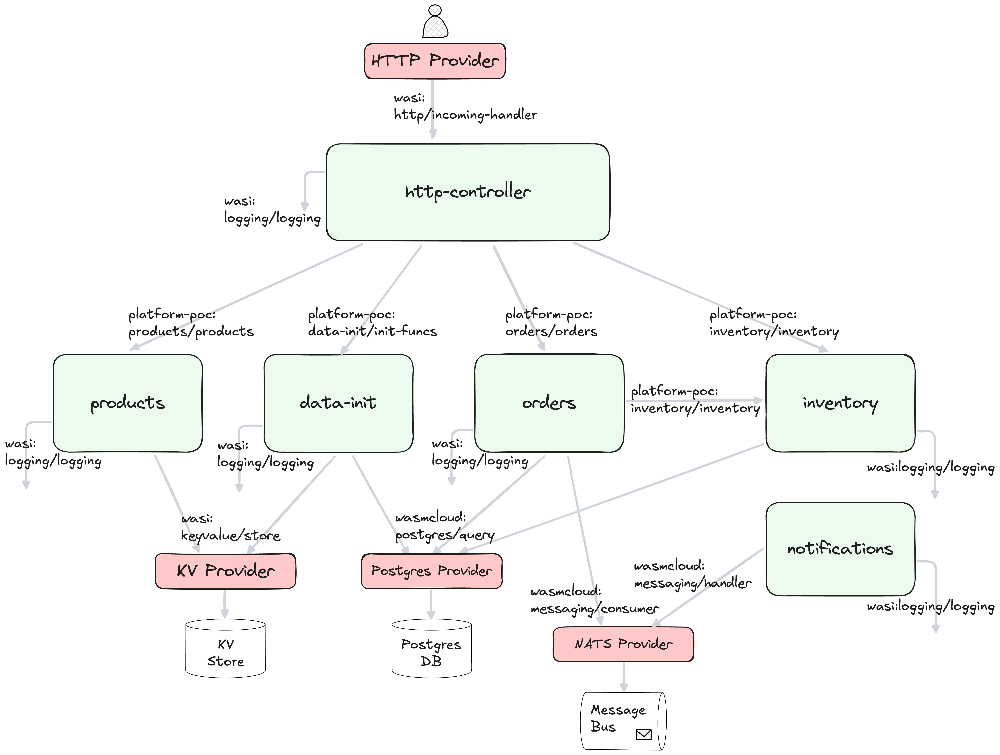

## wasmCloud

_Wasm components linked at runtime (via wRPC) and running in wasmCloud._



### Deploy locally

## Setup

### wasmCloud

Install `wash` with `brew install wash`.

```bash
wash --version
# wash          v0.38.0
# ├ nats-server v2.10.20
# ├ wadm        v0.19.0
# └ wasmcloud   v1.4.2
```

run

```bash
./up.fish
```

### Build and sign the components

```bash
./build_and_sign.fish
```

### Deploy the components with `wadm`

```bash
./start.fish
```

### Redeploy the components with `wadm`

```bash
./restart.fish
```

### Delete the application with `wadm`

```bash
./stop.fish
```

### Stop the wasmCloud host

```bash
./down.fish
```
