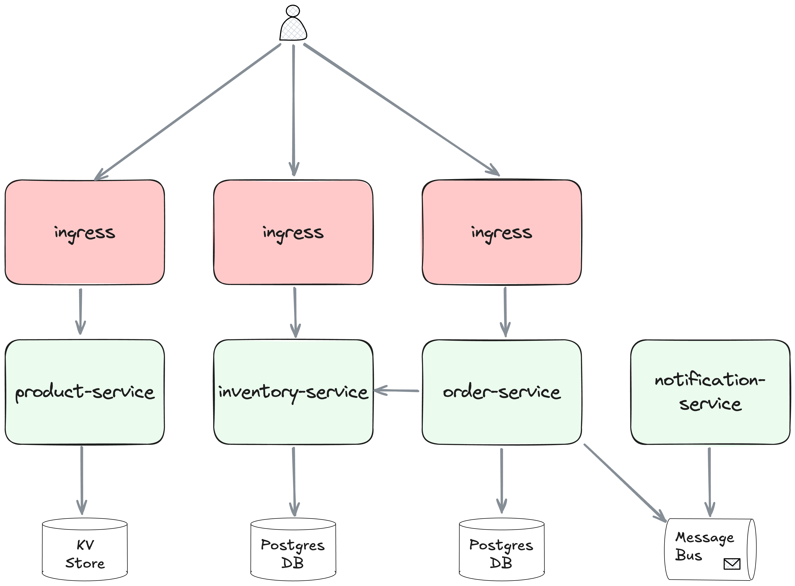

# rust-microservices

A Rust microservices project for use as a benchmark for next gen platform architecture(s)

## High level architecture

This project is heavily inspired by [work in this repo](https://github.com/SaiUpadhyayula/spring-boot-microservices).

There are 4 services described in the diagram below

1. **Product-service** - uses a Redis store to persist the product catalog.
   The products can be queried as a list and new products can be created.
2. **Order-service** - takes a request of a list of order line items,
   checks they are all in stock (http call to the inventory service) and if so,
   creates an order entry in the postgres database and sends an event to NATS pub/sub.
3. **Inventory-service** - takes a request for a product and checks in its postgres database
   if it's in stock
4. **Notification-service** - subscribes to NATS pub/sub and prints a message for new orders

## Running in a local k8s cluster

See this [readme](./kubernetes/local_k3d) for more information on how to run this project in a local k3d cluster.
