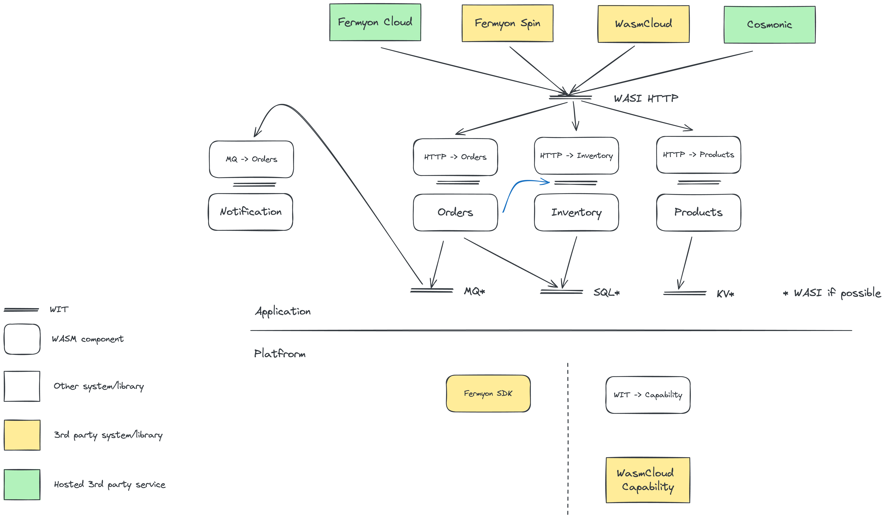

# WebAssembly component microservices / modular monolith

This is a WebAssembly based equivalent to the [Java](../java-containers-k8s/)
and [Rust](../rust-containers-k8s/) microservices, which were designed for
containers.

## Pre-requisites

You will need

- Rust and Cargo (e.g. with [rustup](https://rustup.rs/))
- [Cargo component](https://github.com/bytecodealliance/cargo-component)
  (`cargo install cargo-component`)
- [wit-deps](https://github.com/bytecodealliance/wit-deps)
  (`cargo install wit-deps`)
- [wasm-tools](https://github.com/bytecodealliance/wasm-tools)
  (`cargo install wasm-tools`)
- [wash](https://wasmcloud.com/docs/ecosystem/wash/) (e.g.
  `brew install wasmcloud/wasmcloud/wash`)
- [redis](https://redis.io/) (e.g. `brew install redis`)

## Build and run it

You can build the set of components using the included Makefile:

```sh
$ make
# lots of output
```

### wasmCloud

To run, you need to start redis and wasmcloud

```sh
$ redis-server
# ...
# Ready to accept connections tcp
$ wash up --experimental --nats-websocket-port 4001
# ...
# 🚪 Press `CTRL+c` at any time to exit
```

Those flags allow you to also run

```sh
$ wash ui
# Washboard running on http://localhost:3030
# Hit CTRL-C to stop
```

and monitor the wasmCloud instance in your browser.

Finally, deploy the app:

```sh
$ cd compose
$ wash app deploy wadm.yaml
# Successfully deployed model products-http v0.0.x
```

Once the deployment completes, you can open the products API on
[http://localhost:8081/api/products]. You should get an empty list back.

You can create a new product with

```sh
$ curl http://localhost:8081/api/product \
  --json '{"name":"Teddy bear","description":"He\'s very fluffy!","price":1200,"skuCode":"teddy"}'
# no output
```

Opening the API now should show the product in the list.

## How it works



### Business logic components

The services are implemented as components describing the logic of each service
in terms of custom interfaces, described as WIT:

- products in [`wit/products`](wit/products/products.wit)
- inventory in [`wit/inventory`](wit/inventory/inventory.wit)
- orders TO DO
- notifications TO DO

### HTTP adapters

The services are then adapted (via
[component composition](#component-composition)) to become HTTP service. This is
done with custom adapters, built in Rust, which handle the routing and HTTP
error behaviours, etc.:

- [products-http](./products-http/)
- inventory-http (to do)
- orders-http (to do)
- notifications-http (to do)

### Platform adapters

Similarly, in order to support two of the new WebAssembly hosting platforms -
wasmCloud and Fermyon Spin - the HTTP components are further adapted (via
[composition](#component-composition)) for the platform, fulfilling their
backend dependencies with a method supported by each platform.

These adapters can be considered part of the platform and as WASI specs mature,
these will become less necessary, once the services migrate onto standard WASI
interfaces. The current interfaces are

- Key-Value in [`wit/platform/keyvalue.wit`](wit/platform/keyvalue.wit)
- SQL database (to do)
- Message queue (to do)

#### wasmCloud adapter

For wasmCloud, the custom interfaces are adapted to the supported subset of WASI
interfaces by the `platform-wasmcloud` component.

### Component composition

They key innovative mechanism used throughout this example is WebAssembly
component composition. This allows us to build WebAssembly components (in any
programming language), which provide (export) or consume (import) well defined
interfaces. Using `wasm-tools` we can then compose two (or more) components,
such that an interface imported by one can be linked directly to the same type
of interface exported by another.

In this way, for example, the `products` component exports the `products`
interface and import a key value interface. Composing it with the
`products-http` component fulfils the latter's import of the `products`
interface with the export of the former. At the same time the
`platform-wasmcloud` component can be composed in, fulfilling the keyvalue
import of the `products` component.

The composition no longer exports the `products` interface or imports the
`keyvalue` interface, but it has a new export - `wasi:http/incoming-handler` -
provided by the `products-http` and import - `wasi:keyvalue/readwrite`. Those
two interfaces are part of the wasi standard and supported by wasmCloud, and so
the composed component can be deployed there natively.

Note that for this composition, the source code of the components isn't needed,
only the already compiled `.wasm` component files.
